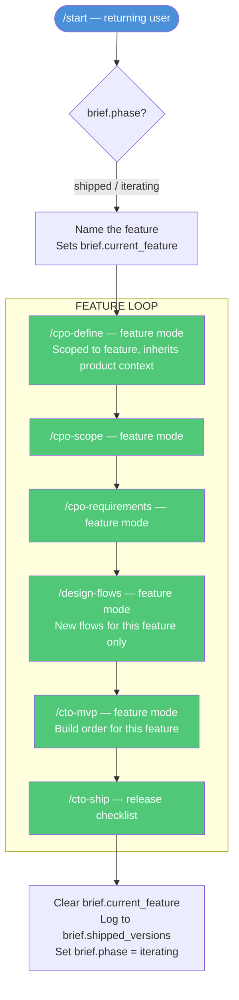

# MVP Spec — WDAI Solopreneur Toolkit
*June 9, 2026 — Builder-facing spec. Use this to build commands and infrastructure.*

---

## What this is

The complete spec for the solopreneur MVP: idea → shipped AI product. Covers the full command set, how data flows through the shared business brief, which commands are one-time vs. iterative, and the design pattern that makes iteration work.

---

## Visual Flow

### First-time flow (idea → shipped product)


---

### Iteration flow (returning user — new feature or sprint)



---

## Command Inventory

### One-time (foundation) commands

Run once to establish the foundation. Revisit only on a pivot or major strategic change — not part of the regular feature cycle.

| Command | What it does | Reads from brief | Writes to brief | Revisit when |
|---|---|---|---|---|
| `/ceo-define-problem` | JTBD — who hires this and for what. Seeds everything downstream. | — | `jtbd`, `niche`, `icp` | Pivoting |
| `/validate` | Confirm people will pay before building anything | `jtbd`, `icp` | `validation_status`, `signals` | Pivoting |
| `/design-brand` | Visual identity — colors, typography, logo direction | `niche`, `icp` | `brand_tokens` | Rebranding |
| `/cto-stack` | Tech stack + build vs. buy decisions | `product_definition`, `founder_technical` | `stack` | Re-platforming |
| `/cto-ai` | Model selection + evals + prompt management design | `requirements`, `stack` | `ai_decisions` | Changing models |
| `/cto-pricing` | Pricing model + tier decisions | `product_definition`, `icp` | `pricing_model` | Repricing |

---

### Iterative commands

Run on every feature or release cycle. Scoped automatically to `brief.current_feature` when set.

| Command | What it does | Reads from brief | Writes to brief | Iteration trigger |
|---|---|---|---|---|
| `/cpo-define` | Product or feature definition | `jtbd`, `icp`, `product_definition` | `product_definition` or `feature_definition` | New product or new feature |
| `/cpo-scope` | Cut — what's in this sprint, what's explicitly out | `product_definition` or `feature_definition` | `current_scope` | Each sprint/release |
| `/cpo-requirements` | Requirements + AI behavior cards | `current_scope` | `current_requirements` | Each sprint/release |
| `/design-flows` | User flows for this feature | `current_requirements`, `brand_tokens` | `current_flows` | Each new user-facing feature |
| `/cto-mvp` | Build order + what to fake first | `current_flows`, `stack`, `ai_decisions` | `build_plan` | Each sprint/release |
| `/cto-ship` | Pre-launch checklist + rollback + AI monitoring | `build_plan` | `ship_status`, `shipped_versions` | Each release |

---

## Iterative Design Pattern

Every iterative command operates in one of three modes, detected automatically from the brief.

### Mode detection

```
1. /start asks: "First time, or working on a new feature?"

2. First time:
   → Run foundation commands in sequence
   → Commands run in full init mode, no prior context

3. New feature (returning user):
   → "What's the feature called?" → sets brief.current_feature
   → Iterative commands scope to that feature automatically
   → Foundation context (brand, stack, AI decisions) inherited silently — not re-asked

4. Resume in progress:
   → /start detects brief.phase and brief.current_feature
   → Routes to the next incomplete command in the loop
```

### The three modes for iterative commands

| Mode | Trigger | Behavior |
|---|---|---|
| `init` | First run, no brief | Full flow — teaches the framework, asks all questions, writes foundation |
| `feature "name"` | `brief.current_feature` is set | Scoped to feature — inherits product context, only asks about the new feature |
| `revise` | User explicitly asks to update | Re-runs the command, updates the relevant brief field, flags downstream commands that need to re-run |

### Example: /cpo-define across the lifecycle

| Run | Mode | What it does |
|---|---|---|
| Building v1 | `init` | Defines the whole product. Writes `product_definition`. |
| Building payments feature | `feature "payments"` | Reads `product_definition` for context. Writes `feature_definition`. |
| Pivoting the product | `revise` | Updates `product_definition`. Notifies user: "Your scope and requirements will need to be revisited." |

### The brief as state machine

The brief tracks lifecycle phase so `/start` always knows where to route:

```
brief.phase:
  "foundation"  → start at /ceo-define-problem
  "prd"         → resume at /cpo-define
  "build"       → resume at current build command
  "shipped"     → offer: new feature or growth commands (Phase 2)
  "iterating"   → resume feature in progress
```

---

## Shared Business Brief — Data Contract

**Status: OPEN — storage format and file design TBD (Patty)**

The stable contract below is what commands read and write, regardless of how the brief is ultimately stored. Any change to field names is a breaking change and requires updating all commands.

### Foundation fields (written once)

| Field | Written by | Read by |
|---|---|---|
| `jtbd` | `/ceo-define-problem` | `/validate`, `/cpo-define`, `/cpo-requirements` |
| `niche` | `/ceo-define-problem` | `/design-brand`, `/cmo-positioning` (Phase 2) |
| `icp` | `/ceo-define-problem` | `/validate`, `/cpo-define`, `/design-brand`, `/cto-pricing` |
| `validation_status` | `/validate` | `/cpo-define` |
| `product_definition` | `/cpo-define` | `/cpo-scope`, `/cto-stack`, `/cto-pricing` |
| `brand_tokens` | `/design-brand` | `/design-flows` |
| `stack` | `/cto-stack` | `/cto-ai`, `/cto-mvp` |
| `ai_decisions` | `/cto-ai` | `/cto-mvp`, `/cto-ship` |
| `pricing_model` | `/cto-pricing` | `/cto-ship`, Phase 2 commands |
| `founder_technical` | `/start` | `/cto-stack`, `/cto-ai` |

### Per-sprint/feature fields (updated each cycle)

| Field | Written by | Read by |
|---|---|---|
| `current_feature` | `/start` | All iterative commands |
| `feature_definition` | `/cpo-define` (feature mode) | `/cpo-scope` |
| `current_scope` | `/cpo-scope` | `/cpo-requirements` |
| `current_requirements` | `/cpo-requirements` | `/design-flows`, `/cto-mvp` |
| `current_flows` | `/design-flows` | `/cto-mvp` |
| `build_plan` | `/cto-mvp` | `/cto-ship` |

### Lifecycle tracking fields

| Field | Written by | Purpose |
|---|---|---|
| `phase` | `/start`, `/cto-ship` | Routes returning users to the right command |
| `ship_status` | `/cto-ship` | Last ship checklist state |
| `shipped_versions` | `/cto-ship` | History of what's been shipped and when |

---

## /start — Routing Front Door

**Status: OPEN — full design TBD**

### What it must do

1. Detect if a brief already exists (returning user vs. first time)
2. If first time: ask 3 questions to seed the brief, then route to `/ceo-define-problem`
   - What's your product idea? (1-2 sentences)
   - Are you technical or non-technical? (sets `founder_technical`)
   - What track? (consulting / workflow / app — sets `track`)
3. If returning: read `brief.phase` and `brief.current_feature`, route to the right command
4. If phase is `shipped` or `iterating`: ask "Are you working on a new feature or something else?" and set `brief.current_feature`

### Routing table

| Brief state | Route to |
|---|---|
| No brief | First-time flow → `/ceo-define-problem` |
| `phase: foundation` | `/ceo-define-problem` (or next incomplete foundation command) |
| `phase: prd` | `/cpo-define` (or next incomplete PRD command) |
| `phase: build` | First incomplete build command |
| `phase: shipped` | Feature loop → name the feature → `/cpo-define` |
| `phase: iterating` | Resume at next incomplete command in feature loop |

---

## Open Items (blocking)

| Item | Owner | Blocks |
|---|---|---|
| Shared business brief — file format, storage, heading conventions | Patty | Every command (they all read/write the brief) |
| `/start` — full question set + routing logic | Anennya + Patty | End-to-end demo |
| ~~Naming alignment~~ — resolved: canonical name is `/ceo-define-problem` | Both | ✅ Done |

---

## Build Order

Build in this sequence to unblock downstream work:

1. **Business brief format** — decide file structure and heading conventions
2. **`/start`** — front door, required for any end-to-end demo
3. **`/ceo-define-problem`** — foundation anchor ✅ built
4. **`/cpo-define`** — first iterative command; proves the init vs. feature mode pattern works
5. **`/cto-ai`** — the differentiator; highest unique value, most novel for the audience
6. **`/validate`** — high leverage, lightweight to build
7. Remaining commands in sequence

---

## Naming — Resolved

Canonical name is `/ceo-define-problem`. Decision: descriptive name wins over brevity — members should understand what a command does without needing to learn a shorthand. This sets the convention for future commands.

---

## Natural Language Flow — June 9, 2026

*Developed in the June 9 huddle. Describes how users experience the system and what infrastructure changes it requires.*

### The brief is the state machine. CLAUDE.md is the router.

Instead of users invoking commands, Claude reads the brief, figures out where they are, and surfaces the next work naturally in conversation. Users never need to know a command name.

**How it works:**

The brief already tracks `phase`, `current_feature`, and `shipped_versions` (see Data Contract above). For natural language routing, it also needs:

```
completed_steps: [ceo-define-problem, cpo-define]
current_step: cpo-scope
next_step: cpo-requirements
```

CLAUDE.md gets a routing section that instructs Claude: *"When a user opens this project, silently check BUSINESS-BRIEF.md. If it exists, greet them by name, tell them where they are, and ask if they want to continue. If it doesn't exist, start the ceo-define-problem flow immediately."*

The user just opens Claude Code and says anything — "I want to work on my business," "hi," "where were we" — and Claude responds:

> "Welcome back. You've defined your problem and your product. You're ready to scope your MVP — that's the step where you decide what's in v1 and explicitly what's not. Want to do that now?"

They say yes. Claude runs the flow. No slash command typed.

---

### Three scenarios, all seamless

**New user, no brief:**
> User: "I want to build an AI tool for HR teams"
> Claude: "Let's start by getting clear on the problem you're solving — that unlocks everything else. I'll ask you 4 questions, takes about 10 minutes." → runs ceo-define-problem flow

**Returning user, mid-journey:**
> User: "hi"
> Claude: "You're on step 3 of 8. You've defined your problem and product — next is scoping your MVP. Ready to pick up there?"

**User describes a pain, not a step:**
> User: "I keep second-guessing what to cut from my v1"
> Claude: "That's exactly what /cpo-scope is for — that's your current step anyway. Want to work through it now?"

---

### What makes this possible technically

Three pieces must work together:

| Piece | Role |
|---|---|
| **CLAUDE.md routing instructions** | Tells Claude to check the brief on session start and interpret natural language against the journey map |
| **Brief with journey state** | `completed_steps`, `current_step`, `next_step` — Claude reads these to know where to pick up (additive to the existing `phase` field) |
| **Commands with good descriptions** | The `description` field in each command file is how Claude matches a pain statement ("I don't know my price") to the right flow |

---

### The one design decision this creates

Do commands stay as slash commands that Claude invokes internally — or do they become pure conversation flows?

- **Keep as slash commands (pragmatic for MVP):** Claude invokes them internally via the Skill tool; users never type them, but command files stay as-is. Users who want direct access still have it.
- **Convert to pure conversation flows (more seamless):** No slash commands at all, just CLAUDE.md instructions and conversation — harder to maintain and test.

The slash command approach is the right call for MVP. Claude does the routing; the commands are an implementation detail users never see.

---

### What this spec needs to add to accommodate natural language flow

| Section | Change needed |
|---|---|
| **Infrastructure table** | Add CLAUDE.md as a third infrastructure piece alongside the brief and `/start` |
| **`/start` design** | Reframe as auto-invoked on session open or optional re-entry — not the primary path users type |
| **Brief data contract** | Add `completed_steps`, `current_step`, `next_step` to lifecycle tracking fields |
| **Command inventory** | Add a natural language triggers column — what a user would *say* that should route to each command |
| **MVP success test** | Rewrite from "ran 8 commands" to "never typed a slash command, always knew what came next" |
| **Consulting track** | Add the 5-6 command consulting sequence so routing works for both tracks |

---

> **Note:** This spec already tracks `phase`, `current_feature`, and `shipped_versions` in the Data Contract. For natural language routing, `completed_steps`, `current_step`, and `next_step` may overlap with `phase`. When finalizing the brief format, evaluate whether these can be consolidated into the existing `phase` field rather than added as separate fields.
