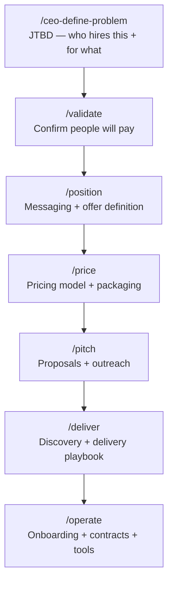

# MVP Spec — WDAI Solopreneur Toolkit
*June 9, 2026 — Builder-facing spec. Use this to build commands and infrastructure.*

---

## Overview

The WDAI toolkit walks a member from "I have an idea" to "I shipped something" across three tracks — consulting, workflow/automation, and apps. The whole thing rests on four pieces working together:

1. **A shared business brief** — the single source of truth. Every command reads context from it and writes its output back, so a member never re-explains their niche, their ICP, or their pricing model to a later command.
2. **`CLAUDE.md` as the router** — on session open, Claude silently checks the brief, knows where the member left off, and routes natural language ("hi", "I want to add a feature", "what should I charge?") to the right command without the member typing a slash command. See [Natural Language Flow](#natural-language-flow--june-9-2026).
3. **`/start` as the explicit fallback** — fires when a member types it directly, or when `CLAUDE.md` can't confidently match intent to a step. See [/start — Routing Front Door](#start--routing-front-door).
4. **Commands built as skills, with frameworks as dynamic subskills** — commands are converging from slash-command files to Skills, matched by description rather than typed syntax. Within a command, the right named framework (Mom Test, Jobs to Be Done, Value-Based Pricing, etc.) is chosen dynamically based on what the member tells you, not hard-coded. See [Architecture: Commands as Skills](#architecture-commands-as-skills--framework-subskills) below.

How members actually get this toolkit into their own project is a separate, currently-being-tested decision — see [Distribution & User Flow](#distribution--user-flow).

Commands split into two kinds:

- **One-time (foundation):** run once, revisited only on a pivot — `/ceo-define-problem`, `/validate`, `/design-brand`, `/cto-stack`, `/cto-ai`, `/cto-pricing`.
- **Iterative:** run on every feature or release cycle, auto-scoped to whatever feature is in progress — `/cpo-define`, `/cpo-scope`, `/cpo-requirements`, `/design-flows`, `/cto-mvp`, `/cto-ship`.

**How to read this doc:** the architecture pattern (skills + frameworks) comes first, then the visual flow diagrams, then the full command inventory with natural-language triggers, then the brief's data contract, then open items and build order. Status tags (`OPEN`, `proposed`, `✅ built`) mark what's decided vs. still in flight.

---

## Architecture: Commands as Skills + Framework Subskills

**Status: EXPERIMENTAL — comparison build in `.claude/skills/test/`, not yet adopted for the canonical commands.**

Claude Code commands and Skills are converging — a Skill is matched by its `description` field against natural language, the same mechanism `CLAUDE.md` needs for routing (see Natural Language Flow). That makes Skills the right container for lifecycle commands going forward, not slash-command files in `.claude/commands/`.

### The pattern

Each command becomes a folder, not a file:

```
.claude/skills/<command-name>/
  SKILL.md                  ← orchestrator: asks a routing question (or infers from
                               context), then reads the matching framework file and
                               runs its question flow
  frameworks/
    <framework-a>.md         ← one framework's question flow + when to use it
    <framework-b>.md
```

The orchestrator doesn't hard-code a single framework per command. Instead it picks the framework that fits the member's situation, the way Aparna's `/ceo-define-problem` subskills work (per the June 9 huddle): ask one routing question, or infer from what the member has already said, then read the corresponding `frameworks/*.md` file and follow it.

### Live example: `test` skill

`.claude/skills/test/` is a side-by-side comparison build for `/ceo-define-problem` — same job (produce a Problem Statement, save it to the brief), but the framework is chosen dynamically:

| Member's situation | Framework used |
|---|---|
| Already talked to real people, has signal | **Jobs to Be Done** — sharpens the job a customer is hiring the product to do |
| Still a hunch, hasn't talked to anyone, only has an opinion | **The Mom Test** — gets past polite lies by asking about past behavior, not hypothetical opinions |

This is deliberately separate from `/ceo-define-problem` so the two can be run on the same input and compared before deciding whether to convert the rest of the command set.

### Why this matters beyond /ceo-define-problem

Several commands in the inventory below map to more than one named framework in `Phase-1-Consolidated.md` — e.g. `/cto-pricing` could choose between **Value-Based Pricing** and **3-Tier Anchoring** depending on whether the member already knows their client's ROI, and `/validate` could choose between **The Mom Test** and **Fake Door / Smoke Test** depending on whether the member has an audience to test with yet. Once the `test` comparison proves the pattern out, the same folder structure extends to those commands.

---

## Visual Flow

### First-time flow (idea → shipped product)


---

### Iteration flow (returning user — new feature or sprint)


---

## Command Inventory

### One-time (foundation) commands

Run once to establish the foundation. Revisit only on a pivot or major strategic change — not part of the regular feature cycle.

| Command | What it does | Reads from brief | Writes to brief | Revisit when | User would say |
|---|---|---|---|---|---|
| `/ceo-define-problem` | JTBD — who hires this and for what. Seeds everything downstream. | — | `jtbd`, `niche`, `icp` | Pivoting | "I have an idea but I'm not sure who it's for" / "What problem am I actually solving?" |
| `/validate` | Confirm people will pay before building anything | `jtbd`, `icp` | `validation_status`, `signals` | Pivoting | "Will people actually pay for this?" / "How do I know this is worth building?" |
| `/design-brand` | Visual identity — colors, typography, logo direction | `niche`, `icp` | `brand_tokens` | Rebranding | "I need a name/logo/colors" / "What should this look like?" |
| `/cto-stack` | Tech stack + build vs. buy decisions | `product_definition`, `founder_technical` | `stack` | Re-platforming | "What should I build this with?" / "Should I build or buy this piece?" |
| `/cto-ai` | Model selection + evals + prompt management design | `requirements`, `stack` | `ai_decisions` | Changing models | "Which AI model should I use?" / "How do I know if the AI is working well?" |
| `/cto-pricing` | Pricing model + tier decisions | `product_definition`, `icp` | `pricing_model` | Repricing | "What should I charge?" / "Should this be a subscription or one-time?" |

---

### Iterative commands

Run on every feature or release cycle. Scoped automatically to `brief.current_feature` when set.

| Command | What it does | Reads from brief | Writes to brief | Iteration trigger | User would say |
|---|---|---|---|---|---|
| `/cpo-define` | Product or feature definition | `jtbd`, `icp`, `product_definition` | `product_definition` or `feature_definition` | New product or new feature | "I want to add [feature]" / "What exactly is this product?" |
| `/cpo-scope` | Cut — what's in this sprint, what's explicitly out | `product_definition` or `feature_definition` | `current_scope` | Each sprint/release | "I keep second-guessing what to cut from v1" / "What should I leave out for now?" |
| `/cpo-requirements` | Requirements + AI behavior cards | `current_scope` | `current_requirements` | Each sprint/release | "What does this actually need to do?" / "How should the AI behave here?" |
| `/design-flows` | User flows for this feature | `current_requirements`, `brand_tokens` | `current_flows` | Each new user-facing feature | "How should this work step by step for the user?" |
| `/cto-mvp` | Build order + what to fake first | `current_flows`, `stack`, `ai_decisions` | `build_plan` | Each sprint/release | "What do I build first?" / "Can I fake this part for now?" |
| `/cto-ship` | Pre-launch checklist + rollback + AI monitoring | `build_plan` | `ship_status`, `shipped_versions` | Each release | "Am I ready to launch this?" / "What do I watch after it's live?" |

---

## Iterative Design Pattern

Every iterative command operates in one of three modes, detected automatically from the brief.

### Mode detection

```
1. /start asks: "First time, or working on a new feature?"

2. First time:
   → Run foundation commands in sequence
   → Commands run in full init mode, no prior context

3. New feature (returning user):
   → "What's the feature called?" → sets brief.current_feature
   → Iterative commands scope to that feature automatically
   → Foundation context (brand, stack, AI decisions) inherited silently — not re-asked

4. Resume in progress:
   → /start detects brief.phase and brief.current_feature
   → Routes to the next incomplete command in the loop
```

### The three modes for iterative commands

| Mode | Trigger | Behavior |
|---|---|---|
| `init` | First run, no brief | Full flow — teaches the framework, asks all questions, writes foundation |
| `feature "name"` | `brief.current_feature` is set | Scoped to feature — inherits product context, only asks about the new feature |
| `revise` | User explicitly asks to update | Re-runs the command, updates the relevant brief field, flags downstream commands that need to re-run |

### Example: /cpo-define across the lifecycle

| Run | Mode | What it does |
|---|---|---|
| Building v1 | `init` | Defines the whole product. Writes `product_definition`. |
| Building payments feature | `feature "payments"` | Reads `product_definition` for context. Writes `feature_definition`. |
| Pivoting the product | `revise` | Updates `product_definition`. Notifies user: "Your scope and requirements will need to be revisited." |

### The brief as state machine

The brief tracks lifecycle phase so `/start` always knows where to route:

```
brief.phase:
  "foundation"  → start at /ceo-define-problem
  "prd"         → resume at /cpo-define
  "build"       → resume at current build command
  "shipped"     → offer: new feature or growth commands (Phase 2)
  "iterating"   → resume feature in progress
```

---

## Distribution & User Flow

**Status: TESTING — primary approach is a Claude Code plugin; fallbacks below are the plan if it doesn't pan out.**

A member's own business lives in their own repo, separate from this toolkit repo. This section is about how the toolkit's commands/skills get into that repo (or otherwise become available to the member) — distinct from the brief's data contract above, which is about what the toolkit writes once it's there.

### Primary: Claude Code plugin

We are testing packaging this repo's `.claude/commands/` and `.claude/skills/` as a Claude Code plugin, distributed via a marketplace hosted in this same repo (`.claude-plugin/marketplace.json` + `.claude-plugin/plugin.json`).

Member flow:
1. `/plugin marketplace add WDAI/business-pdt-workflows` — once.
2. `/plugin install wdai-toolkit@wdai-business` — once.
3. Commands and skills are now available in any project folder the member opens Claude Code in — nothing copied into their repo.
4. `/plugin update` pulls future toolkit changes — no manual re-syncing.

**Constraint this creates:** installed plugin files live in Claude's plugin cache, not in the member's project. So the **business brief must always be written to the member's own project directory (cwd)**, never inside the plugin's own folder — every command's read/write logic has to target cwd. This is consistent with the brief design above; it just has to be an explicit rule once commands ship as a plugin.

### Fallback options if plugin distribution doesn't pan out

| Option | What changes | Tradeoff |
|---|---|---|
| **Copy folders into their repo** | Member clones this repo, copies `.claude/commands/` and `.claude/skills/` directly into their own project | Simplest to explain ("clone, then copy the folder"); frozen snapshot — no auto-updates, member must manually re-copy after every toolkit change |
| **User-level install** | Member copies commands/skills into `~/.claude/` once, available across all their projects without per-repo copying | One-time setup instead of per-project, but still no auto-updates |
| **Template repo / fork** | This repo is a GitHub template; member clicks "Use this template" and gets one combined repo (toolkit + their business) | Easiest single-click start, but their copy diverges from upstream immediately — hardest option to push updates to later |

**Fallback trigger:** if testing shows `/plugin install` is too technical a step for non-technical members, or plugin caching breaks the brief-writes-to-cwd assumption above, fall back to **copy folders into their repo** first — closest behavior to what we're testing now, and the only thing it trades away is auto-updates.

---

## Shared Business Brief — Data Contract

**Status: OPEN — storage format and file design TBD (Patty)**

The stable contract below is what commands read and write, regardless of how the brief is ultimately stored. Any change to field names is a breaking change and requires updating all commands.

### Foundation fields (written once)

| Field | Written by | Read by |
|---|---|---|
| `jtbd` | `/ceo-define-problem` | `/validate`, `/cpo-define`, `/cpo-requirements` |
| `niche` | `/ceo-define-problem` | `/design-brand`, `/cmo-positioning` (Phase 2) |
| `icp` | `/ceo-define-problem` | `/validate`, `/cpo-define`, `/design-brand`, `/cto-pricing` |
| `validation_status` | `/validate` | `/cpo-define` |
| `product_definition` | `/cpo-define` | `/cpo-scope`, `/cto-stack`, `/cto-pricing` |
| `brand_tokens` | `/design-brand` | `/design-flows` |
| `stack` | `/cto-stack` | `/cto-ai`, `/cto-mvp` |
| `ai_decisions` | `/cto-ai` | `/cto-mvp`, `/cto-ship` |
| `pricing_model` | `/cto-pricing` | `/cto-ship`, Phase 2 commands |
| `founder_technical` | `/start` | `/cto-stack`, `/cto-ai` |

### Per-sprint/feature fields (updated each cycle)

| Field | Written by | Read by |
|---|---|---|
| `current_feature` | `/start` | All iterative commands |
| `feature_definition` | `/cpo-define` (feature mode) | `/cpo-scope` |
| `current_scope` | `/cpo-scope` | `/cpo-requirements` |
| `current_requirements` | `/cpo-requirements` | `/design-flows`, `/cto-mvp` |
| `current_flows` | `/design-flows` | `/cto-mvp` |
| `build_plan` | `/cto-mvp` | `/cto-ship` |

### Lifecycle tracking fields

| Field | Written by | Purpose |
|---|---|---|
| `phase` | `/start`, `/cto-ship` | Routes returning users to the right command |
| `ship_status` | `/cto-ship` | Last ship checklist state |
| `shipped_versions` | `/cto-ship` | History of what's been shipped and when |
| `completed_steps` *(proposed)* | All commands, on completion | Ordered list of steps finished — lets `CLAUDE.md` greet returning users by name and progress |
| `current_step` *(proposed)* | All commands, on start | The step in progress right now |
| `next_step` *(proposed)* | All commands, on completion | What `CLAUDE.md` should surface next without being asked |

**Status: OPEN — Patty to decide whether `completed_steps`/`current_step`/`next_step` are added as new fields or consolidated into a more granular `phase` (e.g. `phase: prd:cpo-scope`). Not resolved here — this is brief-format territory.**

---

## /start — Routing Front Door

**Status: OPEN — full design TBD**

**Reframed (June 9):** `/start` is no longer the primary path users type. On session open, `CLAUDE.md` routing instructions silently check the brief and greet the user with where they are — `/start` only fires explicitly when a user types it directly (reset, or "let's start over") or as the fallback if `CLAUDE.md` can't confidently match intent to a step. The logic below still applies; it's just invoked automatically most of the time instead of by name.

### What it must do

1. Detect if a brief already exists (returning user vs. first time)
2. If first time: ask 3 questions to seed the brief, then route to `/ceo-define-problem`
   - What's your product idea? (1-2 sentences)
   - Are you technical or non-technical? (sets `founder_technical`)
   - What track? (consulting / workflow / app — sets `track`)
3. If returning: read `brief.phase` and `brief.current_feature`, route to the right command
4. If phase is `shipped` or `iterating`: ask "Are you working on a new feature or something else?" and set `brief.current_feature`

### Routing table

| Brief state | Route to |
|---|---|
| No brief | First-time flow → `/ceo-define-problem` |
| `phase: foundation` | `/ceo-define-problem` (or next incomplete foundation command) |
| `phase: prd` | `/cpo-define` (or next incomplete PRD command) |
| `phase: build` | First incomplete build command |
| `phase: shipped` | Feature loop → name the feature → `/cpo-define` |
| `phase: iterating` | Resume at next incomplete command in feature loop |

---

## Open Items (blocking)

| Item | Owner | Blocks |
|---|---|---|
| Shared business brief — file format, storage, heading conventions | Patty | Every command (they all read/write the brief) |
| `/start` — full question set + routing logic | Anennya + Patty | End-to-end demo |
| `CLAUDE.md` routing instructions — session-start brief check + NL intent matching | Anennya | Natural language flow (no command typed) |
| Distribution & user flow — test plugin packaging; confirm brief-writes-to-cwd holds under plugin caching | Anennya + Patty | Whether members install via plugin or fall back to copy/template flow |
| ~~Naming alignment~~ — resolved: canonical name is `/ceo-define-problem` | Both | ✅ Done |

Three infrastructure pieces, not two: the **shared brief** (state), **`/start`** (explicit entry point), and **`CLAUDE.md`** (the router that checks the brief on session open and matches natural language to the next step). All three must exist before the natural-language flow works end to end.

---

## Build Order

Build in this sequence to unblock downstream work:

1. **Business brief format** — decide file structure and heading conventions
2. **`/start`** — front door, required for any end-to-end demo
3. **`/ceo-define-problem`** — foundation anchor ✅ built
4. **`/cpo-define`** — first iterative command; proves the init vs. feature mode pattern works
5. **`/cto-ai`** — the differentiator; highest unique value, most novel for the audience
6. **`/validate`** — high leverage, lightweight to build
7. Remaining commands in sequence

---

## MVP Success Test

~~Success = a user ran all 8 foundation/PRD/build commands in sequence.~~

**Revised:** Success = a user went from idea to shipped product **without ever typing a slash command**, and at every point in the conversation, knew what came next without being told to look it up. Concretely, the MVP passes if a first-time user can:

1. Open Claude Code and say anything ("hi", "I want to build X") — and get routed into `/ceo-define-problem` without knowing that command exists.
2. Close the session mid-journey, reopen it later, and be greeted with exactly where they left off and what's next — no re-explaining, no hunting for a command name.
3. Describe a pain ("I keep second-guessing what to cut from v1") and get routed to the right command (`/cpo-scope`) purely from that description.

If a user has to ask "what command do I run now?", the natural-language flow has failed even if every individual command works correctly.

---

## Consulting Track Sequence

The app track (CEO → CPO → CTO → design) above is Phase-1-built. The consulting track shares the same foundation but diverges after `/validate` — it uses the original lifecycle commands from `Phase-1-Consolidated.md`, none of which are built yet.



Six commands after foundation: `/position`, `/price`, `/pitch`, `/deliver`, `/operate`, plus `/grow` (case studies, referrals, upsells) once a client cycle has run — `/grow` is the natural re-entry point for "iterating" on this track, the consulting equivalent of the feature loop. `/promote` is not a step in the sequence; per `Phase-1-Consolidated.md` it's woven into every command's output ("Now share it") rather than run on its own.

None of `/position`, `/price`, `/pitch`, `/deliver`, `/operate`, `/grow` are built yet — they're not in the current Build Order. Add them once the app-track build order proves the init/feature-mode pattern works, since the consulting versions will reuse the same brief-read/write mechanics.

---

## Naming — Resolved

Canonical name is `/ceo-define-problem`. Decision: descriptive name wins over brevity — members should understand what a command does without needing to learn a shorthand. This sets the convention for future commands.

---

## Natural Language Flow — June 9, 2026

*Developed in the June 9 huddle. Describes how users experience the system and what infrastructure changes it requires.*

### The brief is the state machine. CLAUDE.md is the router.

Instead of users invoking commands, Claude reads the brief, figures out where they are, and surfaces the next work naturally in conversation. Users never need to know a command name.

**How it works:**

The brief already tracks `phase`, `current_feature`, and `shipped_versions` (see Data Contract above). For natural language routing, it also needs:

```
completed_steps: [ceo-define-problem, cpo-define]
current_step: cpo-scope
next_step: cpo-requirements
```

CLAUDE.md gets a routing section that instructs Claude: *"When a user opens this project, silently check BUSINESS-BRIEF.md. If it exists, greet them by name, tell them where they are, and ask if they want to continue. If it doesn't exist, start the ceo-define-problem flow immediately."*

The user just opens Claude Code and says anything — "I want to work on my business," "hi," "where were we" — and Claude responds:

> "Welcome back. You've defined your problem and your product. You're ready to scope your MVP — that's the step where you decide what's in v1 and explicitly what's not. Want to do that now?"

They say yes. Claude runs the flow. No slash command typed.

---

### Three scenarios, all seamless

**New user, no brief:**
> User: "I want to build an AI tool for HR teams"
> Claude: "Let's start by getting clear on the problem you're solving — that unlocks everything else. I'll ask you 4 questions, takes about 10 minutes." → runs ceo-define-problem flow

**Returning user, mid-journey:**
> User: "hi"
> Claude: "You're on step 3 of 8. You've defined your problem and product — next is scoping your MVP. Ready to pick up there?"

**User describes a pain, not a step:**
> User: "I keep second-guessing what to cut from my v1"
> Claude: "That's exactly what /cpo-scope is for — that's your current step anyway. Want to work through it now?"

---

### What makes this possible technically

Three pieces must work together:

| Piece | Role |
|---|---|
| **CLAUDE.md routing instructions** | Tells Claude to check the brief on session start and interpret natural language against the journey map |
| **Brief with journey state** | `completed_steps`, `current_step`, `next_step` — Claude reads these to know where to pick up (additive to the existing `phase` field) |
| **Commands with good descriptions** | The `description` field in each command file is how Claude matches a pain statement ("I don't know my price") to the right flow |

---

### The one design decision this creates

Do commands stay as slash commands that Claude invokes internally — or do they become pure conversation flows?

- **Keep as slash commands (pragmatic for MVP):** Claude invokes them internally via the Skill tool; users never type them, but command files stay as-is. Users who want direct access still have it.
- **Convert to pure conversation flows (more seamless):** No slash commands at all, just CLAUDE.md instructions and conversation — harder to maintain and test.

The slash command approach is the right call for MVP. Claude does the routing; the commands are an implementation detail users never see.

---

### What this spec needs to add to accommodate natural language flow

| Section | Change needed |
|---|---|
| **Infrastructure table** | Add CLAUDE.md as a third infrastructure piece alongside the brief and `/start` |
| **`/start` design** | Reframe as auto-invoked on session open or optional re-entry — not the primary path users type |
| **Brief data contract** | Add `completed_steps`, `current_step`, `next_step` to lifecycle tracking fields |
| **Command inventory** | Add a natural language triggers column — what a user would *say* that should route to each command |
| **MVP success test** | Rewrite from "ran 8 commands" to "never typed a slash command, always knew what came next" |
| **Consulting track** | Add the 5-6 command consulting sequence so routing works for both tracks |

---

> **Note:** This spec already tracks `phase`, `current_feature`, and `shipped_versions` in the Data Contract. For natural language routing, `completed_steps`, `current_step`, and `next_step` may overlap with `phase`. When finalizing the brief format, evaluate whether these can be consolidated into the existing `phase` field rather than added as separate fields.
