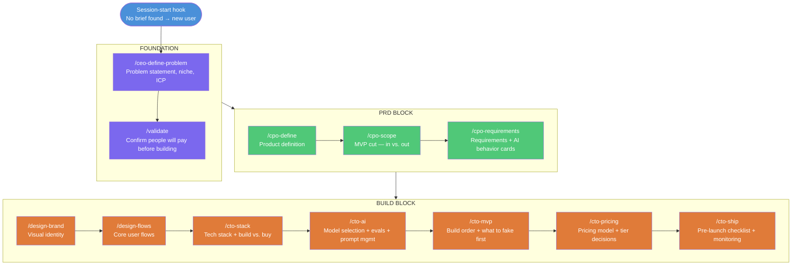
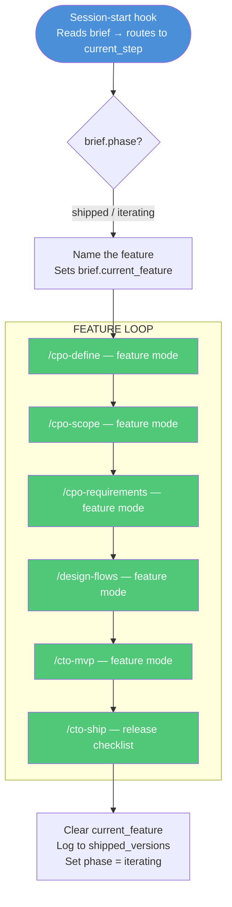
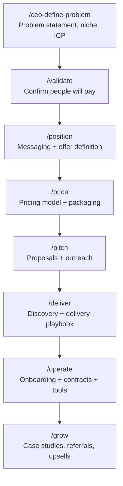

# MVP Spec — WDAI AI Business Toolkit
*Builders: Aparna, Patty, Anennya — Last updated June 16, 2026*

---

## What This Is

The WDAI AI Business Toolkit walks a WDAI member from "I have an idea" to "I shipped something and have clients" — across three tracks:

- **App / Product** — building an AI-powered product (MVP focus)
- **Consulting** — starting an AI consulting practice
- **Workflow** — automating a business with AI workflows

All three tracks share a common foundation (define the problem, validate demand) and a shared business brief that accumulates context across every session. Commands are in plain business language — no assumed technical knowledge. Members are taught one concept at a time, with a "Now share it" moment in every output.

---

## Default User Flow

This is what a member experiences — no slash commands, no setup:

**First time:**
> Member opens Claude Code in their project folder, says anything: "I want to build an AI scheduling tool" or just "hi."
> The plugin's session-start hook sees no `business-brief.md` in the folder, and injects new-user context.
> Claude greets them and goes straight into the `/ceo-define-problem` flow — defining the problem worth solving.

**Returning user:**
> Member opens Claude Code. Hook reads `business-brief.md`, sees `current_step: cpo-scope`.
> Claude: "Welcome back. You've defined your problem and product — next is scoping your MVP. That's where you decide what's in v1 and explicitly what's not. Want to do that now?"
> Member says yes. Claude runs the flow. No slash command typed.

**Returning user with a pain, not a step:**
> Member: "I keep second-guessing what to cut from v1"
> Claude: "That's exactly what we're doing next — scoping the MVP. Let's work through it."

The brief is the memory. The session-start hook is the router. Commands are implementation details the member never sees.

---

## Distribution: Plugin

The toolkit ships as a Claude Code plugin. Members install it once; it works in any project folder they open.

### Install (once, per member)

```
/plugin marketplace add WDAI/business-pdt-workflows
/plugin install wdai-toolkit@wdai-business
```

After install, the plugin's commands and skills are available in every project the member works in.

### What lives where

| File | Location | What it holds | Created by |
|---|---|---|---|
| `wdai-profile.md` | `~/.claude/wdai-profile.md` | Name, track preference — never re-asked | First command run, if not present |
| `business-brief.md` | `./business-brief.md` (in the member's project) | Everything about what they're building right now | Automatically on first command run in that project |
| Plugin files | `~/.claude/plugins/cache/wdai-toolkit/` | Commands, skills, session-start hook | Plugin install |

The plugin never writes to the member's own `CLAUDE.md` or any file outside `business-brief.md` and `wdai-profile.md`.

### Getting updates

When the toolkit is updated, members run `/plugin update` — no manual re-copying.

---

## Session-Start Routing: Plugin Hook

Because the plugin can't rely on a project's `CLAUDE.md` (that file belongs to the member), all session-start routing happens via a **`SessionStart` hook** shipped inside the plugin.

On every session open, the hook:
1. Checks for `./business-brief.md` in the current directory.
2. If found: reads `current_step`, `next_step`, `completed_steps`, and injects that context so Claude greets the member with exactly where they are.
3. If not found: injects new-user context so Claude starts the foundation flow.

The hook also reads `~/.claude/wdai-profile.md` for the member's name and track, so greetings are personal from the first session.

This replaces what `CLAUDE.md` routing instructions would have done. The behavior is identical — Claude checks the brief and routes natural language to the right step — but it's driven by the plugin hook, not a file in the member's project.

Natural language is matched to commands via each skill's `description` field. A member saying "what should I charge?" matches the `/cto-pricing` description without them knowing that command exists.

---

## Business Brief

*Architecture decided June 16, 2026. Full format in `Business Brief Architecture.md`.*

### Format: YAML frontmatter (two blocks) + narrative

Single file `business-brief.md` in the member's project directory.

```markdown
---
# ─── YOUR BUSINESS (you'll rarely touch this) ───
track: product
founder_technical: false
problem_statement: "When X, I want to Y, so I can Z"
niche: "I help [who] with [job]"
icp_seed: "HR directors at mid-size companies..."
product_definition: ""
stack: ""
ai_decisions: ""
pricing_model: ""

# ─── PROGRESS (Claude updates this for you) ───
phase: foundation
current_step: ceo-define-problem
next_step: cpo-define
completed_steps: [start]
current_feature: ""
shipped_versions: []
---

## Your Business Brief

[Human-readable narrative, built up section by section as each command runs.]
```

### When the brief is created

Automatically on the first command run in a new project folder. A member never sets it up manually.

### Field table (canonical names — do not rename without updating all commands)

**Foundation fields — written once:**

| Field | Written by | Read by |
|---|---|---|
| `track` | `/ceo-define-problem` | All commands (filters track-specific content) |
| `founder_technical` | `/start` or `/ceo-define-problem` | `/cto-stack`, `/cto-ai` |
| `problem_statement` | `/ceo-define-problem` | `/validate`, `/cpo-define`, `/cpo-requirements` |
| `niche` | `/ceo-define-problem` | `/design-brand` |
| `icp_seed` | `/ceo-define-problem` | `/validate`, `/cpo-define`, `/cto-pricing` |
| `product_definition` | `/cpo-define` | `/cpo-scope`, `/cto-stack`, `/cto-pricing` |
| `brand_tokens` | `/design-brand` | `/design-flows` |
| `stack` | `/cto-stack` | `/cto-ai`, `/cto-mvp` |
| `ai_decisions` | `/cto-ai` | `/cto-mvp`, `/cto-ship` |
| `pricing_model` | `/cto-pricing` | `/cto-ship` |

**Journey state fields — updated after every command:**

| Field | Written by | Purpose |
|---|---|---|
| `phase` | `/start`, `/cto-ship` | Coarse routing (foundation / prd / build / shipped / iterating) |
| `current_step` | Every command on start | Fine-grained routing — what's in progress right now |
| `next_step` | Every command on completion | What the hook surfaces on next session open |
| `completed_steps` | Every command on completion | Full ordered history |
| `current_feature` | `/start` or NL detection | Set when in feature loop; cleared after ship |
| `shipped_versions` | `/cto-ship` | History of what shipped and when |

**Per-sprint/feature fields — scoped to current feature:**

| Field | Written by | Read by |
|---|---|---|
| `feature_definition` | `/cpo-define` (feature mode) | `/cpo-scope` |
| `current_scope` | `/cpo-scope` | `/cpo-requirements` |
| `current_requirements` | `/cpo-requirements` | `/design-flows`, `/cto-mvp` |
| `current_flows` | `/design-flows` | `/cto-mvp` |
| `build_plan` | `/cto-mvp` | `/cto-ship` |

---

## Architecture: Skills + Framework Subskills

*Status: EXPERIMENTAL — comparison build in `.claude/skills/test/`, not yet adopted for canonical commands.*

Commands are converging from flat `.md` files toward Skills — matched by their `description` field against natural language, which is also how the session-start hook routes NL intent to the right step. Skills are the right container going forward.

### The pattern

```
.claude/skills/<command-name>/
  SKILL.md                  ← orchestrator: detects situation, picks framework
  frameworks/
    <framework-a>.md        ← one framework's question flow + when to use it
    <framework-b>.md
```

The orchestrator picks the framework that fits the member's situation — asks one routing question or infers from what they've said — then follows that framework's flow.

### Live example: `test` skill

`.claude/skills/test/` is a side-by-side comparison of `/ceo-define-problem` with dynamic framework selection:

| Member's situation | Framework used |
|---|---|
| Has talked to real people, has signal | **Jobs to Be Done** — sharpens the job a customer hires the product to do |
| Just a hunch, hasn't talked to anyone | **The Mom Test** — gets past polite answers by asking about past behavior |

Once this proves out, the same folder structure extends to all commands.

---

## Visual Flow

### First-time flow (idea → shipped product)



### Iteration flow (returning user — new feature or sprint)



---

## Command Inventory

### One-time (foundation) commands

Run once. Revisit only on a pivot.

| Command | What it does | Reads | Writes | User would say |
|---|---|---|---|---|
| `/ceo-define-problem` | Problem statement, niche, ICP | — | `problem_statement`, `niche`, `icp_seed` | "I have an idea but I'm not sure who it's for" / "What problem am I actually solving?" |
| `/validate` | Confirm people will pay before building | `problem_statement`, `icp_seed` | `validation_status` | "Will people actually pay for this?" / "How do I know this is worth building?" |
| `/design-brand` | Visual identity — colors, typography, logo direction | `niche`, `icp_seed` | `brand_tokens` | "I need a name / logo / colors" / "What should this look like?" |
| `/cto-stack` | Tech stack + build vs. buy decisions | `product_definition`, `founder_technical` | `stack` | "What should I build this with?" / "Should I build or buy this piece?" |
| `/cto-ai` | Model selection + evals + prompt management | `current_requirements`, `stack` | `ai_decisions` | "Which AI model should I use?" / "How do I know if the AI is working well?" |
| `/cto-pricing` | Pricing model + tier decisions | `product_definition`, `icp_seed` | `pricing_model` | "What should I charge?" / "Should this be a subscription or one-time?" |

### Iterative commands

Run on every feature or release cycle. Scoped automatically to `current_feature` when set.

| Command | What it does | Reads | Writes | User would say |
|---|---|---|---|---|
| `/cpo-define` | Product or feature definition | `problem_statement`, `icp_seed`, `product_definition` | `product_definition` or `feature_definition` | "I want to add [feature]" / "What exactly is this product?" |
| `/cpo-scope` | Cut — what's in this sprint, what's explicitly out | `product_definition` or `feature_definition` | `current_scope` | "I keep second-guessing what to cut from v1" |
| `/cpo-requirements` | Requirements + AI behavior cards | `current_scope` | `current_requirements` | "What does this actually need to do?" / "How should the AI behave here?" |
| `/design-flows` | User flows for this feature | `current_requirements`, `brand_tokens` | `current_flows` | "How should this work step by step for the user?" |
| `/cto-mvp` | Build order + what to fake first | `current_flows`, `stack`, `ai_decisions` | `build_plan` | "What do I build first?" / "Can I fake this part for now?" |
| `/cto-ship` | Pre-launch checklist + rollback + AI monitoring | `build_plan` | `ship_status`, `shipped_versions` | "Am I ready to launch this?" / "What do I watch after it's live?" |

---

## Iterative Design Pattern

Every iterative command operates in one of three modes, detected automatically from the brief.

### The three modes

| Mode | Trigger | Behavior |
|---|---|---|
| `init` | First run, no `product_definition` in brief | Full flow — teaches the framework, asks all questions, writes foundation |
| `feature "name"` | `current_feature` is set in brief | Scoped to that feature — inherits product context, only asks about what's new |
| `revise` | User explicitly asks to update something | Re-runs, updates the relevant field, flags downstream commands that need to re-run |

### Example: /cpo-define across the lifecycle

| Run | Mode | What it does |
|---|---|---|
| Building v1 | `init` | Defines the whole product. Writes `product_definition`. |
| Adding payments feature | `feature "payments"` | Reads `product_definition` for context. Writes `feature_definition`. |
| Pivoting the product | `revise` | Updates `product_definition`. Notifies: "Your scope and requirements need to be revisited." |

### Brief as state machine

```
phase: "foundation"  → start at /ceo-define-problem
phase: "prd"         → resume at /cpo-define
phase: "build"       → resume at current build command
phase: "shipped"     → offer: new feature or growth (Phase 2)
phase: "iterating"   → resume feature in progress
```

---

## /start — Explicit Fallback

`/start` is not the default entry point. The session-start hook handles routing automatically on every session open.

`/start` fires when:
- A member types it directly (reset, "let's start over")
- The hook can't confidently match intent to a step (asks the member to clarify, then routes)

When invoked explicitly:
1. If no brief: ask 3 questions (idea, technical or not, track) → create brief → route to `/ceo-define-problem`
2. If brief exists: read `phase` and `current_feature` → route to next incomplete step
3. If `phase: shipped/iterating`: ask "New feature or something else?" → set `current_feature`

---

## Track Sequences

### App / Product track — MVP build focus

Foundation → PRD Block → Build Block (see Visual Flow above)

### Consulting track — documented, not yet built

Shares the foundation commands. Diverges after `/validate`.



`/promote` is not a step — it's woven into every command's output ("Now share it"). `/grow` is the consulting equivalent of the feature loop.

None of `/position`, `/price`, `/pitch`, `/deliver`, `/operate`, `/grow` are built yet. Add them to the build order once the app-track init/feature-mode pattern is proven.

### Workflow track — TBD

Shares foundation. Track-specific sequence not yet designed.

---

## MVP Success Test

Success = a member went from idea to shipped product **without ever typing a slash command**, and always knew what came next.

Concretely, the MVP passes if a first-time member can:

1. Open Claude Code and say anything ("hi", "I want to build X") — and get routed into the problem-definition flow without knowing a command name exists.
2. Close the session mid-journey, reopen it later, and be greeted with exactly where they left off and what's next — no re-explaining, no hunting.
3. Describe a pain ("I keep second-guessing what to cut from v1") and get routed to the right command purely from natural language.

If a member has to ask "what command do I run now?", the routing has failed even if every individual command works correctly.

---

## Open Items

| Item | Owner | Blocks |
|---|---|---|
| `wdai-profile.md` — format and field list | Patty | Member identity across sessions |
| Plugin packaging — add `.claude-plugin/plugin.json` and `marketplace.json` to this repo | Anennya | Members being able to install |
| SessionStart hook — script that reads brief and injects routing context | Anennya | Default user flow end to end |
| `/start` — full question set + routing logic | Aparna + Patty | End-to-end demo fallback |
| Confirm all commands write to `./business-brief.md` in cwd (not plugin cache) | Anennya | Every command |

---

## Build Order

1. **Plugin packaging** — `plugin.json` + `marketplace.json` so the toolkit can be installed at all
2. **Business brief** — `business-brief.md` B-prime format + `wdai-profile.md` design ✅ format decided
3. **SessionStart hook** — replaces CLAUDE.md routing; reads brief, injects context
4. **`/start`** — explicit fallback / reset
5. **`/ceo-define-problem`** — foundation anchor ✅ built
6. **`/cpo-define`** — first iterative command; proves init vs. feature mode pattern
7. **`/cto-ai`** — highest unique value, most novel for the WDAI audience
8. **`/validate`** — high leverage, lightweight
9. Remaining app-track commands in sequence
10. Consulting-track commands — after app-track pattern is proven
