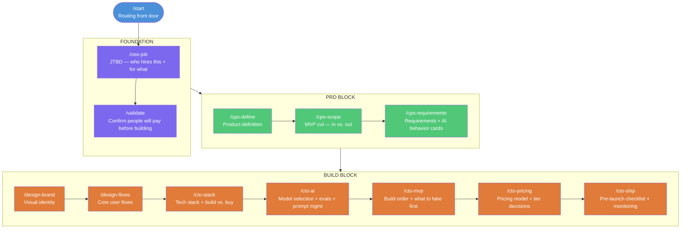

# MVP Spec — WDAI Solopreneur Toolkit
*June 9, 2026 — Builder-facing spec. Use this to build commands and infrastructure.*

---

## What this is

The complete spec for the solopreneur MVP: idea → shipped AI product. Covers the full command set, how data flows through the shared business brief, which commands are one-time vs. iterative, and the design pattern that makes iteration work.

---

## Visual Flow

### First-time flow (idea → shipped product)



---

### Iteration flow (returning user — new feature or sprint)


---

## Command Inventory

### One-time (foundation) commands

Run once to establish the foundation. Revisit only on a pivot or major strategic change — not part of the regular feature cycle.

| Command | What it does | Reads from brief | Writes to brief | Revisit when |
|---|---|---|---|---|
| `/ceo-job` | JTBD — who hires this and for what. Seeds everything downstream. | — | `jtbd`, `niche`, `icp` | Pivoting |
| `/validate` | Confirm people will pay before building anything | `jtbd`, `icp` | `validation_status`, `signals` | Pivoting |
| `/design-brand` | Visual identity — colors, typography, logo direction | `niche`, `icp` | `brand_tokens` | Rebranding |
| `/cto-stack` | Tech stack + build vs. buy decisions | `product_definition`, `founder_technical` | `stack` | Re-platforming |
| `/cto-ai` | Model selection + evals + prompt management design | `requirements`, `stack` | `ai_decisions` | Changing models |
| `/cto-pricing` | Pricing model + tier decisions | `product_definition`, `icp` | `pricing_model` | Repricing |

---

### Iterative commands

Run on every feature or release cycle. Scoped automatically to `brief.current_feature` when set.

| Command | What it does | Reads from brief | Writes to brief | Iteration trigger |
|---|---|---|---|---|
| `/cpo-define` | Product or feature definition | `jtbd`, `icp`, `product_definition` | `product_definition` or `feature_definition` | New product or new feature |
| `/cpo-scope` | Cut — what's in this sprint, what's explicitly out | `product_definition` or `feature_definition` | `current_scope` | Each sprint/release |
| `/cpo-requirements` | Requirements + AI behavior cards | `current_scope` | `current_requirements` | Each sprint/release |
| `/design-flows` | User flows for this feature | `current_requirements`, `brand_tokens` | `current_flows` | Each new user-facing feature |
| `/cto-mvp` | Build order + what to fake first | `current_flows`, `stack`, `ai_decisions` | `build_plan` | Each sprint/release |
| `/cto-ship` | Pre-launch checklist + rollback + AI monitoring | `build_plan` | `ship_status`, `shipped_versions` | Each release |

---

## Iterative Design Pattern

Every iterative command operates in one of three modes, detected automatically from the brief.

### Mode detection

```
1. /start asks: "First time, or working on a new feature?"

2. First time:
   → Run foundation commands in sequence
   → Commands run in full init mode, no prior context

3. New feature (returning user):
   → "What's the feature called?" → sets brief.current_feature
   → Iterative commands scope to that feature automatically
   → Foundation context (brand, stack, AI decisions) inherited silently — not re-asked

4. Resume in progress:
   → /start detects brief.phase and brief.current_feature
   → Routes to the next incomplete command in the loop
```

### The three modes for iterative commands

| Mode | Trigger | Behavior |
|---|---|---|
| `init` | First run, no brief | Full flow — teaches the framework, asks all questions, writes foundation |
| `feature "name"` | `brief.current_feature` is set | Scoped to feature — inherits product context, only asks about the new feature |
| `revise` | User explicitly asks to update | Re-runs the command, updates the relevant brief field, flags downstream commands that need to re-run |

### Example: /cpo-define across the lifecycle

| Run | Mode | What it does |
|---|---|---|
| Building v1 | `init` | Defines the whole product. Writes `product_definition`. |
| Building payments feature | `feature "payments"` | Reads `product_definition` for context. Writes `feature_definition`. |
| Pivoting the product | `revise` | Updates `product_definition`. Notifies user: "Your scope and requirements will need to be revisited." |

### The brief as state machine

The brief tracks lifecycle phase so `/start` always knows where to route:

```
brief.phase:
  "foundation"  → start at /ceo-job
  "prd"         → resume at /cpo-define
  "build"       → resume at current build command
  "shipped"     → offer: new feature or growth commands (Phase 2)
  "iterating"   → resume feature in progress
```

---

## Shared Business Brief — Data Contract

**Status: OPEN — storage format and file design TBD (Patty)**

The stable contract below is what commands read and write, regardless of how the brief is ultimately stored. Any change to field names is a breaking change and requires updating all commands.

### Foundation fields (written once)

| Field | Written by | Read by |
|---|---|---|
| `jtbd` | `/ceo-job` | `/validate`, `/cpo-define`, `/cpo-requirements` |
| `niche` | `/ceo-job` | `/design-brand`, `/cmo-positioning` (Phase 2) |
| `icp` | `/ceo-job` | `/validate`, `/cpo-define`, `/design-brand`, `/cto-pricing` |
| `validation_status` | `/validate` | `/cpo-define` |
| `product_definition` | `/cpo-define` | `/cpo-scope`, `/cto-stack`, `/cto-pricing` |
| `brand_tokens` | `/design-brand` | `/design-flows` |
| `stack` | `/cto-stack` | `/cto-ai`, `/cto-mvp` |
| `ai_decisions` | `/cto-ai` | `/cto-mvp`, `/cto-ship` |
| `pricing_model` | `/cto-pricing` | `/cto-ship`, Phase 2 commands |
| `founder_technical` | `/start` | `/cto-stack`, `/cto-ai` |

### Per-sprint/feature fields (updated each cycle)

| Field | Written by | Read by |
|---|---|---|
| `current_feature` | `/start` | All iterative commands |
| `feature_definition` | `/cpo-define` (feature mode) | `/cpo-scope` |
| `current_scope` | `/cpo-scope` | `/cpo-requirements` |
| `current_requirements` | `/cpo-requirements` | `/design-flows`, `/cto-mvp` |
| `current_flows` | `/design-flows` | `/cto-mvp` |
| `build_plan` | `/cto-mvp` | `/cto-ship` |

### Lifecycle tracking fields

| Field | Written by | Purpose |
|---|---|---|
| `phase` | `/start`, `/cto-ship` | Routes returning users to the right command |
| `ship_status` | `/cto-ship` | Last ship checklist state |
| `shipped_versions` | `/cto-ship` | History of what's been shipped and when |

---

## /start — Routing Front Door

**Status: OPEN — full design TBD**

### What it must do

1. Detect if a brief already exists (returning user vs. first time)
2. If first time: ask 3 questions to seed the brief, then route to `/ceo-job`
   - What's your product idea? (1-2 sentences)
   - Are you technical or non-technical? (sets `founder_technical`)
   - What track? (consulting / workflow / app — sets `track`)
3. If returning: read `brief.phase` and `brief.current_feature`, route to the right command
4. If phase is `shipped` or `iterating`: ask "Are you working on a new feature or something else?" and set `brief.current_feature`

### Routing table

| Brief state | Route to |
|---|---|
| No brief | First-time flow → `/ceo-job` |
| `phase: foundation` | `/ceo-job` (or next incomplete foundation command) |
| `phase: prd` | `/cpo-define` (or next incomplete PRD command) |
| `phase: build` | First incomplete build command |
| `phase: shipped` | Feature loop → name the feature → `/cpo-define` |
| `phase: iterating` | Resume at next incomplete command in feature loop |

---

## Open Items (blocking)

| Item | Owner | Blocks |
|---|---|---|
| Shared business brief — file format, storage, heading conventions | Patty | Every command (they all read/write the brief) |
| `/start` — full question set + routing logic | Anennya + Patty | End-to-end demo |
| Naming alignment: `ceo-define-problem` vs. `/ceo-job` | Both | Build consistency |

---

## Build Order

Build in this sequence to unblock downstream work:

1. **Business brief format** — decide file structure and heading conventions
2. **`/start`** — front door, required for any end-to-end demo
3. **`/ceo-job`** — foundation anchor (draft exists as `ceo-define-problem`, needs alignment)
4. **`/cpo-define`** — first iterative command; proves the init vs. feature mode pattern works
5. **`/cto-ai`** — the differentiator; highest unique value, most novel for the audience
6. **`/validate`** — high leverage, lightweight to build
7. Remaining commands in sequence

---

## Naming Alignment Needed

`ceo-define-problem` (currently built by Patty) maps to `/ceo-job` in this spec. The names describe the same thing — decide on the canonical name before building more commands to avoid churn.

Options:
- Keep `ceo-define-problem` — more descriptive for members
- Use `ceo-job` — shorter, consistent with the C-suite naming convention (`cpo-define`, `cto-stack`, etc.)
